# 🩺 Medicare Pro - AI-Powered Clinic Management System


Medicare Pro is a full-stack, intelligent healthcare management platform. It features a **public-facing website** for product information and a **secure, data-driven Doctor Dashboard** for managing patients, appointments, and generating AI-assisted prescriptions.

## 🚀 Live Demo

- **Frontend (Vercel):** [https://nerve-connect-frontend.vercel.app](https://nerve-connect-frontend.vercel.app)
- **Backend (Render):** [https://nerveconnect-backend.onrender.com](https://nerveconnect-backend.onrender.com)

---

## ✨ Features

This project's features are formally defined in the official **Software Requirements Specification (SRS)**.

### 🏥 Public-Facing Website (`/`)
- **FR-WEB-001: Product Marketing Pages** — A static site (`LandingPage.jsx`) with sections for Features, Testimonials, FAQs, and a Product Demo video.
- **FR-WEB-003: Contact Form** — A "Contact Us" page with a functional form to send messages to the clinic.
- **FR-WEB-004: User Onboarding** — "Login" (`/signin`) and "Get Started" (`/signup`) buttons to route users to the secure application.

### 🧑‍⚕️ Doctor Dashboard (`/dashboard`)

#### 🔐 FR-AUTH: Secure Authentication
- **Public Registration:** Sign Up (`/signup`) and Sign In (`/signin`) flows for doctors.
- **JWT Session Handling:** Uses `jsonwebtoken` for stateless authentication, storing tokens in secure `httpOnly` cookies.
- **Password Hashing:** Uses `bcryptjs` for secure password hashing and salting.
- **Protected Routes:** Uses Express middleware to secure all patient and appointment data APIs.

#### 📊 FR-DASH: Overview Dashboard
- **Analytics Widgets:** Visualize "Total Patients", "Total Appointments", and "Completed Today" using Recharts.
- **Activity Feeds:** Show "Recent Activity" and "Upcoming Appointments".

#### 👩‍⚕️ FR-PATIENT: Patient Management
- **Full CRUD:** Create, read, update, and delete patient records.
- **Search & Filter:** Search through all registered patients via the "Patients" tab.

#### 🗓️ FR-APP: Appointment Management
- **Full CRUD:** Manage appointments with full create, read, update, and delete functionality.
- **Vitals & Symptoms:** Capture complete medical data like Diagnosis, Symptoms, Temperature, Blood Pressure, etc.

#### 💊 FR-VISIT-RX: AI Prescription Workflow
- **Medical Record Modal:** Display all visit data in one interface.
- **AI Suggestions:** Send visit context (vitals, symptoms, patient history) to the **Anthropic MCP Server** for prescription drafting.
- **Doctor-in-the-Loop (DITL):** Doctor reviews and approves AI-generated text before saving.

---

## 🧱 System Architecture

```mermaid
graph TD
    User[👤 User] --> FE(⚛️ React Frontend on Vercel);
    FE --> BE(⚙️ Node/Express Backend on Render);
    
    subgraph Backend
        BE --> Auth(🔐 Auth Middleware);
        Auth --> Patients(👩‍⚕️ Patient Routes);
        Auth --> Appts(🗓️ Appt. Routes);
        BE --> AI(🤖 AI Model / MCP Server);
        Patients --> DB[(💾 MongoDB Atlas)];
        Appts --> DB[(💾 MongoDB Atlas)];
    end

    style FE fill:#282c34,stroke:#61DAFB,stroke-width:2px,color:#fff;
    style BE fill:#333,stroke:#3C873A,stroke-width:2px,color:#fff;
    style DB fill:#47A248,stroke:#fff,stroke-width:2px,color:#fff;
    style AI fill:#D97A3A,stroke:#fff,stroke-width:2px,color:#fff;
```



---

## 🛠️ Tech Stack

| **Category** | **Technology** | **Purpose** |
|---------------|----------------|--------------|
| **Frontend** | React 18, Vite, React Router | Core UI, routing, build system |
|  | Tailwind CSS, Lucide Icons | Styling and icons |
|  | Recharts | Data visualization for dashboard |
|  | Zod | Schema declaration and validation |
| **Backend** | Node.js, Express.js | Server environment & API framework |
| **Database** | MongoDB (Mongoose + Atlas) | Data storage for patients, appointments, users |
| **Authentication** | jsonwebtoken, bcryptjs, cookie-parser | Secure auth & session management |
| **AI Integration** | Anthropic MCP Server (axios) | AI prescription generation |
| **Deployment** | Vercel (Frontend), Render (Backend) | Hosting & CI/CD |

---

## 🔑 Environment Variables

### 1️⃣ Backend (`/backend/.env`)
```bash
# Server Configuration
PORT=4000
FRONTEND_URL=http://localhost:5173

# MongoDB Connection
MONGODB_URI=mongodb+srv://<username>:<password>@yourcluster.mongodb.net/yourDatabaseName

# JWT Secret
JWT_SECRET=THIS_IS_A_VERY_STRONG_AND_RANDOM_SECRET_KEY

# AI Model API Key
AI_API_KEY=YOUR_AI_API_KEY_HERE
```

### 2️⃣ Frontend (`/frontend/.env.local`)
```bash
VITE_BACKEND_URL=http://localhost:4000
```

---

## ⚙️ Local Setup & Development

### Step 1: Clone the Repository
```bash
git clone https://github.com/Sankalpa-01/NerveConnect.git
cd NerveConnect
```

### Step 2: Setup the Backend
```bash
cd backend
npm install
touch .env  # add variables from above
npm start
```
Server runs at: **http://localhost:4000**

### Step 3: Setup the Frontend
```bash
cd frontend
npm install
touch .env.local  # add variables from above
npm run dev
```
Frontend runs at: **http://localhost:5173**

---

## 🧪 Testing the App

- Public Site → [http://localhost:5173/](http://localhost:5173/)
- Sign Up → [http://localhost:5173/signup](http://localhost:5173/signup)
- Sign In → [http://localhost:5173/signin](http://localhost:5173/signin)
- Dashboard → [http://localhost:5173/dashboard](http://localhost:5173/dashboard)

---

## 🏁 Future Scope

As outlined in **SRS Appendix B**, future expansions include:

- [ ] Patient Dashboard — View-only portal for patients.
- [ ] Doctor Verification API — Integrate national registry for verification.
- [ ] Billing & Insurance Module — Fee tracking and invoice generation.
- [ ] Pharmacy/EMR Integration — Send prescriptions to external pharmacies.
- [ ] Multi-Role Admin Panel — System settings and account management.

---

## 📄 License

This project is licensed under the **MIT License**.