# 🩺 NerveConnect - AI-Powered Clinic Management System


NerveConnect is an intelligent, full-stack hospital management platform. It combines an **AI Voice Frontdesk** for seamless, voice-driven appointment booking and a **Doctor Dashboard** powered by the Gemini AI for smart prescription generation.

## 🚀 Live Demo

* **Frontend (Vercel):** [https://nerve-connect-frontend.vercel.app](https://nerve-connect-frontend.vercel.app)
* **Backend (Render):** [https://nerveconnect-backend.onrender.com](https://nerveconnect-backend.onrender.com)

## ✨ Features

### 🎤 AI Voice Frontdesk (`/frontdesk`)
* **Voice-Enabled Appointments:** Uses the Web Speech API to capture user voice.
* **AI Transcript Parsing:** Sends the voice transcript to the backend (`/api/auth/parse`) to understand intent and schedule appointments, mimicking a human receptionist.

### 🧑‍⚕️ Doctor Dashboard (`/dashboard`)
* **Full Patient & Appointment CRUD:** Securely create, read, update, and delete patient records and clinic appointments.
* **AI-Powered Prescription Generation:** Uses the Google Gemini API to generate detailed prescription drafts based on symptoms, diagnosis, and vitals.
* **Doctor-in-the-Loop (DITL):** Provides a "Review, Edit, and Approve" interface, ensuring a licensed doctor has final control over all AI-generated suggestions before they are saved.
* **Light/Dark Mode:** Toggles for user comfort.

### 🔐 Secure Authentication
* **Full Auth Flow:** Complete user lifecycle with Sign-Up, Sign-In, and Sign-Out.
* **JWT Session Handling:** Uses `jsonwebtoken` for stateless authentication.
* **Secure Cookie Storage:** Stores the auth token in an `httpOnly` cookie for protection against XSS attacks.
* **Password Hashing:** Uses `bcryptjs` to securely hash and salt user passwords.
* **Protected Routes:** Employs Express middleware to secure all API endpoints related to patient and appointment data.

## 🧱 System Architecture

The project is a monorepo with a decoupled frontend and backend.

```mermaid
graph TD
    User[👤 User] --> FE(⚛️ React Frontend on Vercel);
    FE --> BE(⚙️ Node/Express Backend on Render);
    FE --> VAPI(🗣️ Web Speech API);
    
    subgraph Backend
        BE --> Auth(🔐 Auth Middleware);
        Auth --> Patients(👩‍⚕️ Patient Routes);
        Auth --> Appts(🗓️ Appt. Routes);
        BE --> Gemini(🤖 Google Gemini API);
        Patients --> DB[(💾 MongoDB Atlas)];
        Appts --> DB[(💾 MongoDB Atlas)];
    end

    style FE fill:#282c34,stroke:#61DAFB,stroke-width:2px,color:#fff;
    style BE fill:#333,stroke:#3C873A,stroke-width:2px,color:#fff;
    style DB fill:#47A248,stroke:#fff,stroke-width:2px,color:#fff;
    style Gemini fill:#4285F4,stroke:#fff,stroke-width:2px,color:#fff;
    style VAPI fill:#f44336,stroke:#fff,stroke-width:2px,color:#fff;
```



## 🛠️ Tech Stack

| Category | Technology |
|-----------|-------------|
| **Frontend** | React 18, Vite, React Router, Tailwind CSS, Lucide Icons, Web Speech API |
| **Backend** | Node.js, Express.js |
| **Database** | MongoDB (via Mongoose & MongoDB Atlas) |
| **Authentication** | jsonwebtoken, bcryptjs, cookie-parser |
| **AI** | Google Gemini API (generativelanguage.googleapis.com) |
| **Deployment** | Vercel (Frontend), Render (Backend) |

## 🔑 Environment Variables

### 1. Backend (`/backend/.env`)
```ini
# Server Configuration
PORT=4000
FRONTEND_URL=http://localhost:5173

# MongoDB Connection String
MONGODB_URI=mongodb+srv://<username>:<password>@yourcluster.mongodb.net/yourDatabaseName

# JWT Authentication Secret
JWT_SECRET=THIS_IS_A_VERY_STRONG_AND_RANDOM_SECRET_KEY

# Google Gemini API Key (Get from Google AI Studio)
GEMINI_API_KEY=YOUR_GEMINI_API_KEY_HERE
```

### 2. Frontend (`/frontend/.env.local`)
```ini
VITE_BACKEND_URL=http://localhost:4000
```

## ⚙️ Local Setup & Development

### 1. Clone the Repository
```bash
git clone https://github.com/Sankalpa-01/NerveConnect.git
cd NerveConnect
```

### 2. Set Up the Backend
```bash
cd backend
npm install
touch .env
npm start
```
Backend runs on **http://localhost:4000**.

### 3. Set Up the Frontend
```bash
cd frontend
npm install
touch .env.local
npm run dev
```
Frontend runs on **http://localhost:5173**.

## 🧪 Testing the App

* **Sign Up:** http://localhost:5173/signup  
* **Sign In:** http://localhost:5173/signin  
* **Dashboard:** http://localhost:5173/dashboard  

## 🏁 Future Scope / Todo

- [ ] Implement doctor availability calendar  
- [ ] Add real-time notifications for new appointments  
- [ ] Build a "Patient Portal" for users to view their records  
- [ ] Implement secure admin verification for new doctors (HIPAA compliance)  

## 📄 License

This project is licensed under the **MIT License**.  
© 2025 Rishabh Anand
